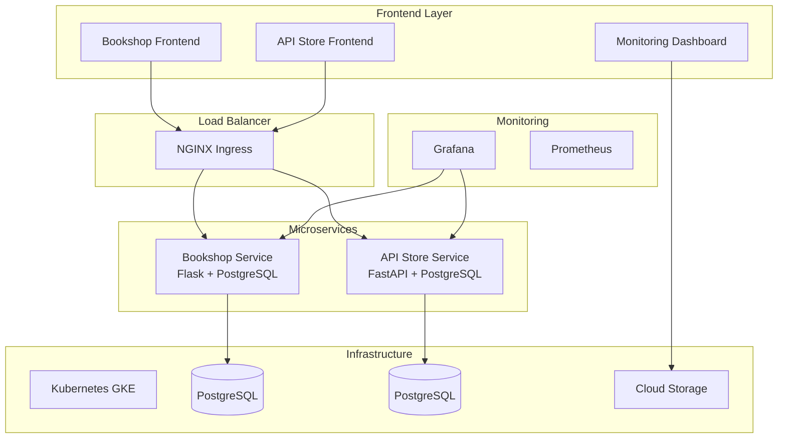

# 🎯 Diploma Project - Enterprise Microservices Platform

> **Полнофункциональная система микросервисов с CI/CD, мониторингом и облачным развертыванием**

[](https://github.com/bagorbenko/tms-ah-diploma/actions)
[](https://kubernetes.io/)
[](https://docker.com/)
[](https://cloud.google.com/)

## 📋 Содержание

- [🏗️ Архитектура](#️-архитектура)
- [🚀 Быстрый старт](#-быстрый-старт)
- [🌐 Доступ к сервисам](#-доступ-к-сервисам)
- [🔧 Локальная разработка](#-локальная-разработка)
- [☁️ Облачное развертывание](#️-облачное-развертывание)
- [📊 Мониторинг](#-мониторинг)
- [🔒 Безопасность](#-безопасность)
- [🧪 Тестирование](#-тестирование)
- [📚 API Документация](#-api-документация)
- [🛠️ Разработка](#️-разработка)

## 🏗️ Архитектура

### Обзор системы



### Технологический стек

#### Backend Services
- **Bookshop Service**: Flask 3.0.0, PostgreSQL, SQLAlchemy
- **API Store Service**: FastAPI 0.104.0, PostgreSQL, Pydantic v2

#### Frontend
- **HTML5/CSS3/JavaScript**: Responsive веб-интерфейсы
- **Bootstrap 5**: UI компоненты
- **Chart.js**: Графики и аналитика

#### Infrastructure
- **Kubernetes**: Оркестрация контейнеров (GKE)
- **Docker**: Контейнеризация
- **PostgreSQL**: Основная база данных
- **NGINX**: Reverse proxy и load balancing

#### DevOps & Monitoring
- **GitHub Actions**: CI/CD pipeline
- **Grafana**: Мониторинг и дашборды
- **Terraform**: Infrastructure as Code
- **Google Cloud Platform**: Облачная платформа

## 🚀 Быстрый старт

### Предварительные требования

- Docker и Docker Compose
- kubectl (для Kubernetes)
- Google Cloud SDK (для облачного развертывания)
- Git

### Локальный запуск

```bash
# 1. Клонирование репозитория
git clone https://github.com/bagorbenko/tms-ah-diploma.git
cd tms-ah-diploma

# 2. Запуск с Docker Compose
docker-compose up -d

# 3. Проверка статуса
docker-compose ps

# 4. Доступ к сервисам
echo "Bookshop: http://localhost:8000"
echo "API Store: http://localhost:5050"
echo "Frontend: http://localhost:3000"
```

### Облачное развертывание

```bash
# 1. Настройка GCP
gcloud auth login
gcloud config set project YOUR_PROJECT_ID

# 2. Развертывание через CI/CD
git push origin main
# Pipeline автоматически развернет все сервисы
```

## 🌐 Доступ к сервисам

### Production Environment

| Сервис | URL | Описание |
|--------|-----|----------|
| **Bookshop** | [http://35.241.155.121](http://35.241.155.121) | Основной магазин книг |
| **API Store** | [http://130.211.61.44](http://130.211.61.44) | Analytics API |
| **Grafana** | [http://34.76.217.129:32743](http://34.76.217.129:32743) | Мониторинг |
| **Dashboard** | [Monitoring Dashboard](https://storage.googleapis.com/diploma-static-prod-645ba250/monitoring-dashboard.html) | Обзор системы |

### DuckDNS Domains

| Домен | Сервис | Status |
|-------|--------|--------|
| [bookshop-diploma-project.duckdns.org](http://bookshop-diploma-project.duckdns.org) | Bookshop | ✅ Active |
| [api-diploma-project.duckdns.org](http://api-diploma-project.duckdns.org) | API Store | ✅ Active |
| [grafana-diploma-project.duckdns.org:32743](http://grafana-diploma-project.duckdns.org:32743) | Grafana | ✅ Active |

### Local Development

| Сервис | URL | Порт |
|--------|-----|------|
| Bookshop | http://localhost:8000 | 8000 |
| API Store | http://localhost:5050 | 5050 |
| Frontend | http://localhost:3000 | 3000 |
| PostgreSQL (Bookshop) | localhost:5432 | 5432 |
| PostgreSQL (API Store) | localhost:5433 | 5433 |

## 🔧 Локальная разработка

### Структура проекта

```
fullstack/
├── api-store/                 # FastAPI сервис
│   ├── app/                   # Основной код приложения
│   ├── migrations/            # Alembic миграции
│   ├── Dockerfile            # Docker конфигурация
│   └── requirements.txt      # Python зависимости
├── bookshop/                 # Flask сервис
│   ├── app/                  # Основной код приложения
│   ├── migrations/           # Flask-Migrate миграции
│   ├── Dockerfile           # Docker конфигурация
│   └── requirements.txt     # Python зависимости
├── k8s/                     # Kubernetes манифесты
│   ├── api-store-deployment.yaml
│   ├── bookshop-deployment.yaml
│   ├── grafana-final.yaml
│   └── tls-certificates.yaml
├── terraform/               # Infrastructure as Code
├── .github/workflows/       # CI/CD pipeline
├── docker-compose.yml       # Локальная разработка
└── monitoring-dashboard.html # Мониторинг интерфейс
```

### Разработка сервисов

#### Bookshop Service (Flask)

```bash
cd bookshop
python -m venv venv
source venv/bin/activate  # Linux/Mac
pip install -r requirements.txt

# Запуск в режиме разработки
export FLASK_ENV=development
python run.py
```

#### API Store Service (FastAPI)

```bash
cd api-store
python -m venv venv
source venv/bin/activate  # Linux/Mac
pip install -r requirements.txt

# Запуск в режиме разработки
uvicorn app.main:app --reload --host 0.0.0.0 --port 5050
```

### База данных

#### Миграции Bookshop (Flask-Migrate)

```bash
cd bookshop
flask db init      # Инициализация
flask db migrate   # Создание миграции
flask db upgrade   # Применение миграций
```

#### Миграции API Store (Alembic)

```bash
cd api-store
alembic revision --autogenerate -m "Description"
alembic upgrade head
```

## ☁️ Облачное развертывание

### Google Cloud Platform

Проект развернут в GCP с использованием:

- **GKE (Google Kubernetes Engine)**: Управляемый Kubernetes
- **Cloud Storage**: Статические файлы
- **Cloud SQL**: Управляемые PostgreSQL базы данных
- **Load Balancer**: Распределение нагрузки

### Terraform Infrastructure

```bash
cd terraform
terraform init
terraform plan
terraform apply
```

### Kubernetes Deployment

```bash
# Развертывание всех сервисов
kubectl apply -f k8s/

# Проверка статуса
kubectl get pods --all-namespaces
kubectl get services --all-namespaces
```

### CI/CD Pipeline

GitHub Actions автоматически выполняет:

1. **🚀 Initialize Pipeline** - Инициализация
2. **🔨 Build Applications** - Сборка Docker образов
3. **🧪 Test Suite** - Запуск тестов
4. **📊 Code Quality Analysis** - Анализ качества кода
5. **🔒 Security Scanning** - Сканирование безопасности
6. **🏗️ Infrastructure as Code** - Terraform
7. **🚀 Deploy Applications** - Развертывание в Kubernetes
8. **🔐 DuckDNS & TLS Setup** - Настройка доменов и SSL
9. **📊 Setup Monitoring** - Развертывание Grafana
10. **🏋️ Load Testing** - Нагрузочное тестирование
11. **🌐 Deploy Static Content** - Развертывание фронтенда

## 📊 Мониторинг

### Grafana Dashboard

**Доступ**: http://34.76.217.129:32743
- **Логин**: `admin`
- **Пароль**: `diploma-2025`

### Monitoring Dashboard

**URL**: [Monitoring Dashboard](https://storage.googleapis.com/diploma-static-prod-645ba250/monitoring-dashboard.html)

Функции:
- ⚡ Real-time health checks
- 📊 Service status overview
- 🔗 Quick access links
- 📈 Performance metrics

### Метрики

- **Response Time**: Время отклика сервисов
- **Error Rate**: Частота ошибок
- **Throughput**: Пропускная способность
- **Resource Usage**: Использование ресурсов

## 🔒 Безопасность

### Implemented Security Measures

- **TLS/SSL**: Шифрование трафика (Let's Encrypt)
- **Environment Variables**: Безопасное хранение секретов
- **Network Policies**: Изоляция сетевого трафика
- **Security Scanning**: Автоматическое сканирование уязвимостей
- **Input Validation**: Валидация пользовательского ввода

### Secrets Management

```bash
# GitHub Secrets (настроены в репозитории)
GCP_SA_KEY              # Google Cloud Service Account
DUCKDNS_TOKEN          # DuckDNS API token
TF_STATE_BUCKET        # Terraform state bucket
```

### SSL/TLS Certificates

Автоматическое получение и обновление SSL сертификатов через:
- **cert-manager**: Kubernetes оператор
- **Let's Encrypt**: Бесплатные SSL сертификаты
- **DuckDNS**: DNS challenge для валидации

## 🧪 Тестирование

### Unit Tests

```bash
# Bookshop tests
cd bookshop
python -m pytest tests/

# API Store tests
cd api-store
python -m pytest app/test_main.py
```

### Load Testing (k6)

```bash
# Локальное тестирование
k6 run tests/load-test.js

# С переменными окружения
BOOKSHOP_URL=http://35.241.155.121 \
API_STORE_URL=http://130.211.61.44 \
k6 run tests/load-test.js
```

### Test Coverage

- **Unit Tests**: Покрытие основной бизнес-логики
- **Integration Tests**: API endpoints
- **Load Tests**: Performance и стабильность
- **Security Tests**: Vulnerability scanning

## 📚 API Документация

### Bookshop API

**Base URL**: `http://35.241.155.121` или `http://localhost:8000`

#### Endpoints

| Method | Endpoint | Description |
|--------|----------|-------------|
| GET | `/api/books` | Получить все книги |
| POST | `/api/books` | Создать новую книгу |
| GET | `/api/authors` | Получить всех авторов |
| POST | `/api/authors` | Создать нового автора |
| GET | `/api/categories` | Получить все категории |
| POST | `/api/categories` | Создать новую категорию |
| POST | `/api/cart/add` | Добавить в корзину |
| GET | `/api/cart` | Получить корзину |
| POST | `/api/orders` | Создать заказ |

#### Пример запроса

```bash
# Получить все книги
curl -X GET "http://35.241.155.121/api/books"

# Создать новую книгу
curl -X POST "http://35.241.155.121/api/books" \
  -H "Content-Type: application/json" \
  -d '{
    "title": "New Book",
    "author_id": 1,
    "category_id": 1,
    "price": 1500,
    "stock": 10
  }'
```

### API Store API

**Base URL**: `http://130.211.61.44` или `http://localhost:5050`

**Swagger UI**: `http://130.211.61.44/docs`

#### Endpoints

| Method | Endpoint | Description |
|--------|----------|-------------|
| GET | `/` | Health check |
| GET | `/purchases` | Получить все покупки |
| POST | `/purchases` | Создать покупки |

#### Пример запроса

```bash
# Health check
curl -X GET "http://130.211.61.44/"

# Получить покупки
curl -X GET "http://130.211.61.44/purchases"
```

## 🛠️ Разработка

### Добавление нового сервиса

1. **Создать директорию сервиса**
```bash
mkdir new-service
cd new-service
```

2. **Добавить Dockerfile**
```dockerfile
FROM python:3.11-slim
WORKDIR /app
COPY requirements.txt .
RUN pip install -r requirements.txt
COPY . .
EXPOSE 8080
CMD ["python", "app.py"]
```

3. **Создать Kubernetes манифест**
```yaml
# k8s/new-service-deployment.yaml
apiVersion: apps/v1
kind: Deployment
metadata:
  name: new-service
spec:
  replicas: 2
  selector:
    matchLabels:
      app: new-service
  template:
    metadata:
      labels:
        app: new-service
    spec:
      containers:
      - name: new-service
        image: gcr.io/PROJECT_ID/new-service:latest
        ports:
        - containerPort: 8080
```

4. **Обновить CI/CD pipeline**
```yaml
# .github/workflows/enterprise-cicd.yml
# Добавить new-service в matrix strategy
strategy:
  matrix:
    service: [api-store, bookshop, new-service]
```

### Debugging

#### Логи сервисов

```bash
# Kubernetes логи
kubectl logs -f deployment/bookshop -n bookshop-prod
kubectl logs -f deployment/api-store -n api-store-prod

# Docker Compose логи
docker-compose logs -f bookshop
docker-compose logs -f api-store
```

#### Подключение к базе данных

```bash
# Локальная разработка
psql -h localhost -p 5432 -U bookshop_user -d bookshop_db
psql -h localhost -p 5433 -U api_store_user -d api_store_db

# Kubernetes (port-forward)
kubectl port-forward svc/postgres-bookshop 5432:5432 -n bookshop-prod
psql -h localhost -p 5432 -U bookshop_user -d bookshop_db
```

### Полезные команды

```bash
# Kubernetes
kubectl get all --all-namespaces
kubectl describe pod POD_NAME -n NAMESPACE
kubectl exec -it POD_NAME -n NAMESPACE -- /bin/bash

# Docker
docker-compose up -d --build
docker-compose down -v
docker system prune -a

# Git
git log --oneline -10
git status
git add . && git commit -m "feat: description" && git push
```

## 📋 Troubleshooting

### Частые проблемы

#### 1. Сервис недоступен
```bash
# Проверить статус подов
kubectl get pods -n NAMESPACE

# Проверить логи
kubectl logs POD_NAME -n NAMESPACE

# Проверить сервисы
kubectl get svc -n NAMESPACE
```

#### 2. База данных недоступна
```bash
# Проверить подключение
kubectl exec -it POD_NAME -n NAMESPACE -- psql -h postgres -U username -d database

# Проверить миграции
kubectl exec -it POD_NAME -n NAMESPACE -- alembic current
```

#### 3. CI/CD pipeline fails
```bash
# Проверить секреты в GitHub
# Проверить права доступа к GCP
# Проверить Terraform state
```

## 🤝 Contributing

1. Fork репозиторий
2. Создать feature branch (`git checkout -b feature/amazing-feature`)
3. Commit изменения (`git commit -m 'Add amazing feature'`)
4. Push в branch (`git push origin feature/amazing-feature`)
5. Открыть Pull Request

## 📄 License

Этот проект создан в образовательных целях для дипломной работы.

## 👥 Authors

- **Student**: Aliaksei Bagorbenko
- **Institution**: TMS Academy
- **Year**: 2025

## 🙏 Acknowledgments

- TMS Academy за образовательную программу
- Google Cloud Platform за облачную инфраструктуру
- Open Source сообщество за инструменты и библиотеки

---

## 📞 Support

Если у вас есть вопросы или проблемы:

1. Проверьте [Troubleshooting](#-troubleshooting) секцию
2. Посмотрите [GitHub Issues](https://github.com/bagorbenko/tms-ah-diploma/issues)
3. Проверьте [Monitoring Dashboard](https://storage.googleapis.com/diploma-static-prod-645ba250/monitoring-dashboard.html)

**Последнее обновление**: 24 июня 2025

---

*🎯 Diploma Project - Enterprise Microservices Platform*
